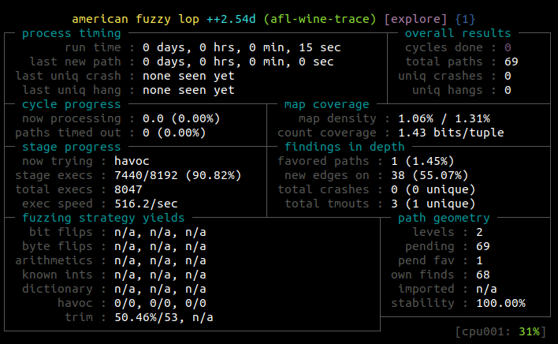

# WineAFLplusplusDEMO

> Note: this feature will be integrated soon in AFL++ after proper testing with the -W command line switch

A set of helpers and examples to fuzz Win32 binaries with AFL++ QEMU

### Requirements

To fuzz Win32 PE applications with AFL++ QEMU you must ensure that your Linux
distribution is able to run Wine without preloader.

Check it simply typing:

```
$ WINELOADERNOEXEC=1 wine cmd
```

You need also python3 and the pefile package.

### Fuzz

Clone the master branch of [AFL++](https://github.com/vanhauser-thc/AFLplusplus)
and build qemu_mode (use CPU_TARGET=i386 for this example).

Copy the `afl-wine-trace` script into the AFL++ path or export AFL_PATH.

To fuzz a PE run it like in the following example with pnginfo.exe:

```
AFL_SKIP_BIN_CHECK=1 ~/AFLplusplus/afl-fuzz -i in/ -o out -d -m none -- ~/AFLplusplus/afl-wine-trace ./pnginfo.exe @@
```

AFL_SKIP_BIN_CHECK is needed cause afl-wine-trace is not a binary.
Without `-m none` the probability that Wine generates an ENOMEM is high.

The following screen should be familiar to you:


